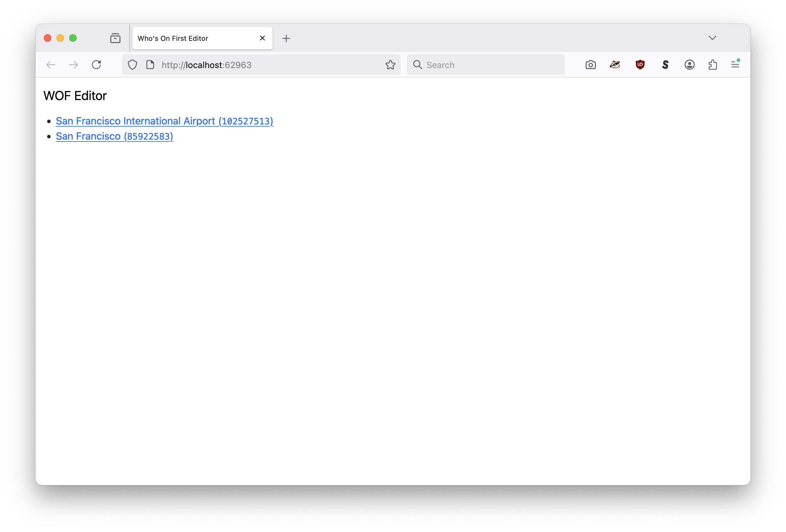
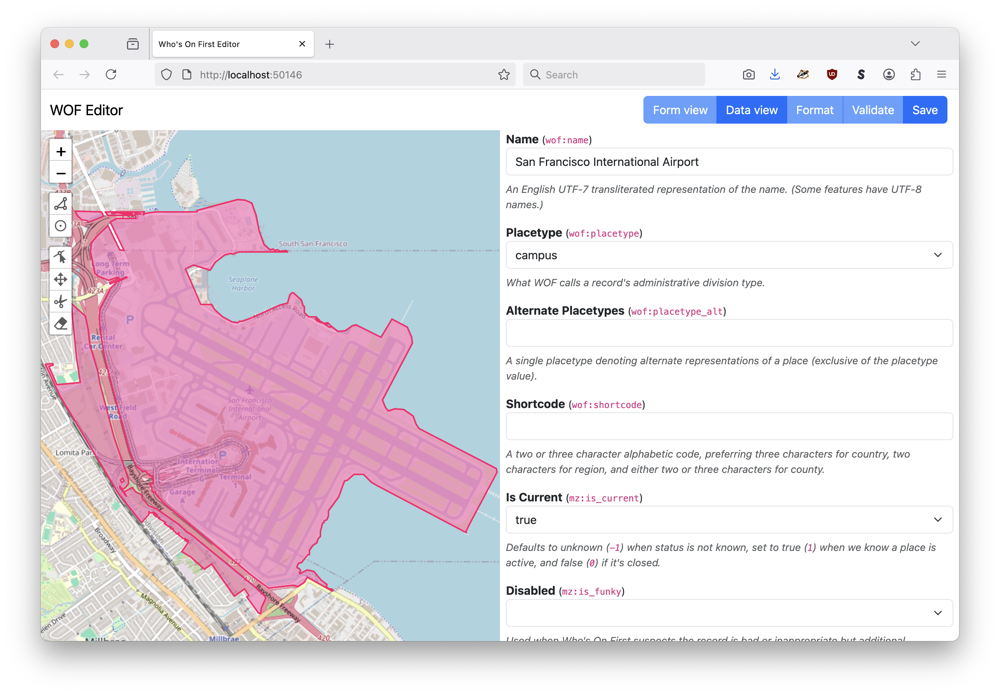
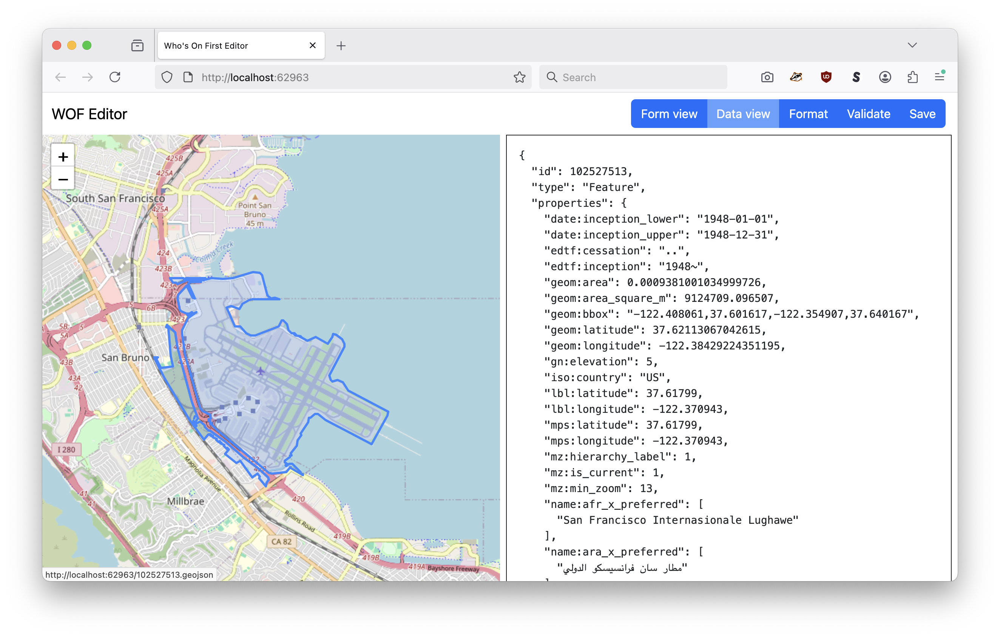
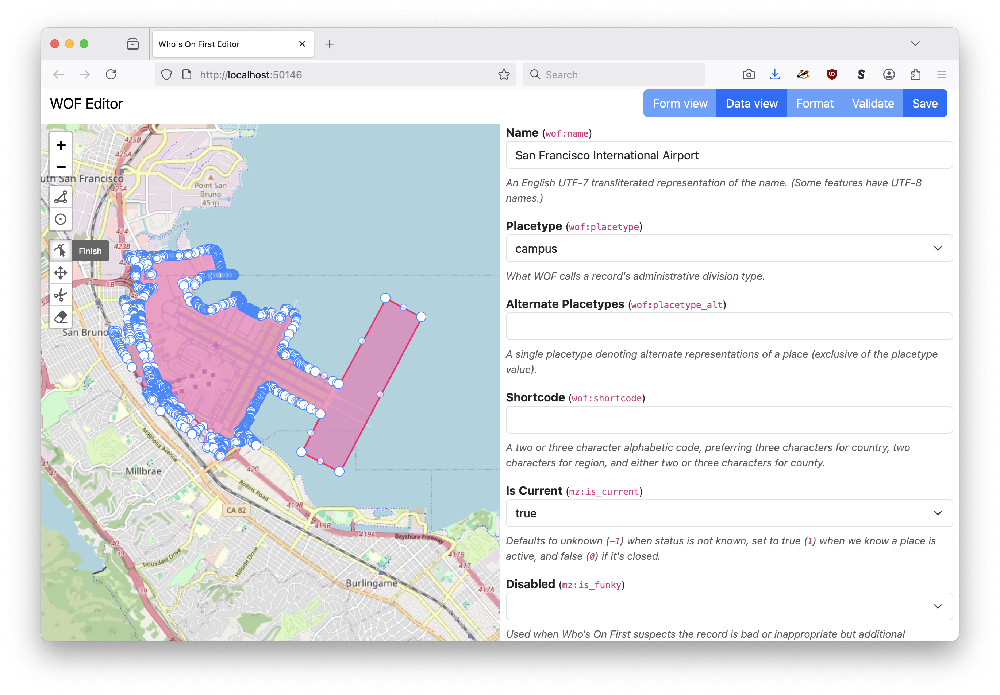
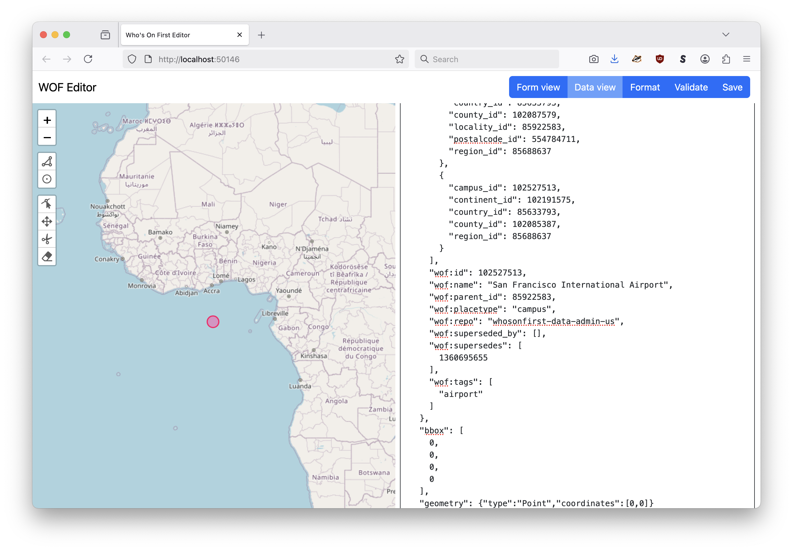

# wof

## edit

Launch a local web server running on a random port hosting a web application for editing one or more Who's On First documents.

```
$> ./bin/wof edit -h
Launch a local web server running on a random port hosting a web application for editing one or more Who's On First records.
Usage:
	 ./bin/wof path(N) path(N)
  -ensure-relative-path
    	Boolean flag signaling that each URI should be expanded to its fully-quality WOF-style relative path. This flag is only processed if the -reader-uri flag is not-empty.
  -gh-access-token-uri string
    	A valid GitHub API access token. This is only necessary if -writer-uri is "wof-pr://".
  -map-provider string
    	Valid options are: leaflet, protomaps (default "leaflet")
  -map-tile-uri string
    	A valid Leaflet tile layer URI. See documentation for special-case (interpolated tile) URIs. (default "https://tile.openstreetmap.org/{z}/{x}/{y}.png")
  -protomaps-max-data-zoom int
    	The maximum zoom (tile) level for data in a PMTiles database. Necessary for "over-zooming".
  -protomaps-theme string
    	A valid Protomaps theme label. (default "light")
  -reader-uri string
    	An optional whosonfirst/go-reader/v2.Reader URI used to read WOF records from alternate sources. If defined then the -writer-uri flag must also be populated.
  -verbose
    	Enable verbose (debug) logging.
  -writer-uri string
    	An optional whosonfirst/go-writer/v3.Writer URI used to write records to alternate sources. If defined then the -reader-uri flag must also be populated.
```

The `wof edit` command is modeled after the [iandees/wof-editor](https://github.com/iandees/wof-editor) package with the following changes:

* It uses a local WebAssembly (WASM) binary to expose methods for data formatting, data validation and Who's On First placetype-related functionality.

* It provides a user-interface for editing the raw GeoJSON of a Who's On First record.

* It enables the editing of GeoJSON `Feature` geometries from both the graphical user and raw data interfaces. The application does _NOT_ provide any facilities for automatically updating parent or hierarchy information because it still lacks built-in point-in-polygon functionality. Support for that functionality is on the list but I haven't quite figured out how best to implement it yet.

### Examples

```
$> ./bin/wof edit \
	/usr/local/data/whosonfirst/whosonfirst-data-admin-us/data/102/527/513/102527513.geojson \
	/usr/local/data/whosonfirst/whosonfirst-data-admin-us/data/859/225/83/85922583.geojson

2025/10/07 11:10:17 INFO Server is ready and features are viewable url=http://localhost:62963
```

This will open `http://localhost:62963` (or whatever port the tool chooses) in your default web browser to a "list" view, like this:



Clicking on one of the links will display that WOF record in the "form" view for editing, like this:



_You can return to the "list" view by clicking on `WOF Editor` header._

The form view is a limited set of common WOF properties which most often need to be edited. This view is modeled after the interface in the [iandees/wof-editor](https://github.com/iandees/wof-editor) package. If you want to edit the raw GeoJSON for the record itself click the `Data view` button in the navigation tool bar. This will display the record in an editable `<pre>` element like this:



_The `Format` and `Validate` buttons are only enabled in "data" view. Data validation and formatting happens automatically in "form" view whenever a property is updated._

#### Geometries

It is also possible to edit geometries for individual records using the graphical controls placed on the left-hand side of the map:



Or by manually editing a record's geometry in the "data" view:



When manually editing geometries their coordinate values will be updated in the graphical interface when the record in question is saved or validated, but not formatted. The application does _NOT_ provide any facilities for automatically updating parent or hierarchy information because it still lacks built-in point-in-polygon functionality. Support for that functionality is on the list but I haven't quite figured out how best to implement it yet.

_As of this writing map tiles default to [OpenStreetMap](https://openstreetmap.org) which has a maximum zoom level of 18. The map itself has a maximum zoom level of 22 to account for detailed geometries but this, in turn, means that map tiles are not visible between zoom levels 19-22. Once support for the use of [Protomaps](https://protomaps.com) map tiles is enable this problem should go away._

#### Reading and writing from alternates source and targets

By default, the `wof edit` command reads and writes files from, and to, the local disk or STDIN/STDOUT. It is possible to specify alternate sources and targets for reading and writing documents using the `-reader-uri` and `-writer-uri` flags.

_Note that if either the `-reader-uri` or `-writer-uri` flag is defined the both must be defined or the edit tool will throw an error._

The `-reader-uri` and `-writer-uri` flags define URIs for instantiating instances of the [whosonfirst/go-reader](https://github.com/whosonfirst/go-reader) and [whosonfirst/go-writer](https://github.com/whosonfirst/go-writer) interfaces respectively. For example to read WOF records from the `https://data.whosonfirst.org` enpoint and write changes to STDOUT:

```
$> ./bin/wof edit \
	-reader-uri https://data.whosonfirst.org \
	-writer-uri stdout:// \
	102/527/513/102527513.geojson
```

Or to read a WOF from a specific GitHub repository (and write changes to STDOUT):

```
$> ./bin/wof edit \
	-reader-uri 'github://sfomuseum-data/sfomuseum-data-whosonfirst?branch=main&prefix=data' \
	-writer-uri stdout:// \
	-ensure-relative-path \
	102527513
```

Note the use of the `-ensure-relative-path` flag. This will parse and URIs passed in (for example "102527513") and derive it's fully qualified relative URI ("102/527/513/102527513.geojson") before trying to read any data.

It is also possible to read a record directly from GitHub deriving its exact repository on the fly using a ["findingaid" reader implementation](https://github.com/whosonfirst/go-reader-findingaid). For example, reading WOF data derived from the SFO Museum findingaid and writing changes to the local `/tmp` directory:

```
$> ./bin/wof edit \
	-reader-uri 'findingaid://https/static.sfomuseum.org/findingaid?template=https://raw.githubusercontent.com/sfomuseum-data/{repo}/main/data/' \
	-writer-uri fs:///tmp \
	-ensure-relative-path \
	102527513
```

Support for the following reader and writer implementations is enabled by default:

##### Readers

* Everything exported by the [whosonfirst/go-reader](https://github.com/whosonfirst/go-reader) package
* Readers exported by the [whosonfirst/go-reader-github](https://github.com/whosonfirst/go-reader-github) package for reading WOF records from GitHub HTTP and API endpoints.
* Readers exported by the [whosonfirst/go-reader-findingaid](https://github.com/whosonfirst/go-reader-findingaid) package for reading WOF records from a source derived on the fly based on their `wof:repo` properties.

##### Writers

* Everything exported by the [whosonfirst/go-writer](https://github.com/whosonfirst/go-writer?tab=readme-ov-file#writers) package
* Writers exported by the [whosonfirst/go-reader-github](https://github.com/whosonfirst/go-writer-github) package for writing WOF records to GitHub, as either push or pull requests, using the GitHub API.

#### Reading and writing from Who's On First (.org) specific source and targets

The `wof-cli edit` command ships with two "shortcut" reader and writer URIs, one for reading the most recent data for WOF records directly from the GitHub repository they are stored in and one for writing changes to a record as pull request again the GitHub repository they are stored in.

##### wof-findingaid://

The `wof-findingaid://` reader URI is just syntactic sugar to automatically assign the `findingaid://https/data.whosonfirst.org/findingaid...` reader-uri and ensure-relative-path flags.

```
$> ./bin/wof edit \
	-verbose \
	-reader-uri wof-findingaid:// \
	-writer-uri stdout:// \
	102527513
```

_Remember that when you specify a custom `-reader-uri` flag you must also specify a corresponding `-writer-uri` flag. In this example all changes are written to STDOUT._

##### wof-pr://

The `wof-pr://` writer URI is also just syntactic sugar to automatically assign a `githubapi-pr://` writer-uri (and ensure-relative-path) flag. Under the hood this is using [whosonfirst/go-writer-github](https://github.com/whosonfirst/go-writer-github?tab=readme-ov-file#githubapi-pr) package to build and submit a PR when a WOF document is saved.

```
$> ./bin/wof edit \
	-verbose \
	-reader-uri wof-findingaid:// \
	-writer-uri wof-pr:// \
	-gh-access-token-uri file:///usr/local/data/gh_token \
	102527513
```

By default the `githubapi-pr://` writer URI requires a lot of configuration options. Most of these are handled automatically by the `wof-cli edit` tool but you still need to specify a valid GitHub API token for submitting the PR.

These access tokens are expected to be defined as valid [gocloud.dev/runtimevar](https://gocloud.dev/howto/runtimevar/) URIs (in order that the tokens themselves don't need to be exposed on the command line or in process lists). The `wof-cli edit` tool uses the [aaronland/gocloud/runtimevar](https://github.com/aaronland/gocloud/tree/main/runtimevar) package to derive string values from `runtimevar` URIs. Please consult the documentation for those packages for details.

#### Base map tiles

##### Raster tiles

The `edit` defaults to using [OpenStreetMap](https://openstreetmap.org) raster tiles for its base map.

If you want to use another raster-based "slippy map" provider, you can do by assigning it ZXY tile URL with the `-map-tile-uri`. For example:

...

##### Protomaps tiles

You can also use local Protomaps PMTiles databases or the [Protomaps API](#) for the base map. To do you need to set the `-map-provider` flag to "leaflet" and specify a Protomaps-specific URL in the `-map-tile-uri` flag. For example to use a local Protomaps database:

```
$> ./bin/wof edit \
	-map-provider protomaps \
	-map-tile-uri 'file:///usr/local/data/sfo-2.pmtiles' \
	-protomaps-theme light \
	/usr/local/data/whosonfirst/whosonfirst-data-admin-us/data/102/527/513/102527513.geojson
```

Or to use the [Protomaps API](#). For example:

```
$> ./bin/wof edit \
	-map-provider protomaps \
	-map-tile-uri '...' \
	-protomaps-theme light \
	/usr/local/data/whosonfirst/whosonfirst-data-admin-us/data/102/527/513/102527513.geojson
```

...using the `extract` tool in the [protomaps/go-pmtiles](#) package. For example:

```
$> cd go-pmtiles
$> go run main.go extract \
	--bbox="-122.430267,37.582678,-122.334137,37.657732" \
	https://build.protomaps.com/20251030.pmtiles \
	/usr/local/data/sfo-2.pmtiles

fetching 8 dirs, 8 chunks, 7 requests
Region tiles 135, result tile entries 131
fetching 131 tiles, 31 chunks, 26 requests
...
Completed in 7.324686375s with 4 download threads (17.884724383608987 tiles/s).
Extract required 36 total requests.
Extract transferred 3.1 MB (overfetch 0.05) for an archive size of 3.0 MB
```

## Notes (and caveats)

Changes made in the `wof edit` tool are not written to disk (or STDOUT) until the `Save` button is pressed.

There is a noticeable delay at startup while the WASM binary (used for data formatting, validation and other functionality) is initialized. This is not ideal and future work will focus on speeding it up. For the time being it is an accepted inconvenience.

## Under the hood

The `wof edit` tool is a simple web application consisting of three parts:

1. A simple HTML + JavaScript + CSS application which provides the interface and interaction components.
2. A WebAssembly (WASM) binary to provide data formatting, validation and other editing-related methods in the client.
3. A simple web server to host the first two components and to expose a minimalist API for listing, retrieving and updating WOF documents.

The goal is to define modular components which can be used in a mix-and-match style across applications or programming languages. For example, although these tools are written in Go the hope is the API layer is sufficiently easy to reimplement in a different programming environment which would allow for it to simply "drop in" the HTML and WASM components without any additional changes.

The source code for the web application, including the WASM binary, can be viewed in the [edit/static](static) folder.

The source code for building the WASM binary can be viewed in the [cmd/wof-edit-wasm](../cmd/wof-edit-wasm) folder.

The source code for the API methods can be viewed in the [edit/http](http) folder.

### API

The API, as referenced by the web application, consists of the following methods.

#### GET /data/{id}

Return the GeoJSON-encoded `Feature` record matching `{id}`. The semantics of how `{id}` is interpreted and where that data is retrieved from are left as implementation-specific details.

#### GET /api/list

Return a JSON-encoded list of record identifiers (or URIs) exposed by the API. These URIs should be able to be retrieved using the `/data/{id}` endpoint.

#### POST /api/save/{id}

This API method accepts GeoJSON-encoded `Feature` record, as the body of the request, and saves it to `{id}`. The semantics of how `{id}` is interpreted and where that data is saved to are left as implementation-specific details.

If you are writing a custom implementation you should take care to both validate and format the data server-side (even though will have been done client-side by the WASM-provided methods).

### WASM

The `wof edit` tool is bundled with a pre-built WASM binary for performing edit-related functions. If you need or want to rebuild the binary the easiest way to do that is to run the `wasmjs` Makefile target from the root of the `wof-cli` project. For example:

```
$> make wasmjs
GOOS=js GOARCH=wasm \
		go build -mod vendor -ldflags="-s -w" -tags wasmjs \
		-o edit/static/wasm/wof_edit.wasm \
		cmd/wof-edit-wasm/main.go
```

## Dates

Who's On First uses the Library of Congress' [Extended Date/Time Format](https://www.loc.gov/standards/datetime/) syntax for encoding dates. The syntax for unknown or "open" dates was changes in 2019 after initial values had been assigned to many WOF records.

The `wof-cli edit` tool will, when possible, update those values when a record is loaded. Those values will not be persisted unless and until that record is explictly saved.

## See also

* https://github.com/iandees/wof-editor
* https://github.com/yairEO/tagify