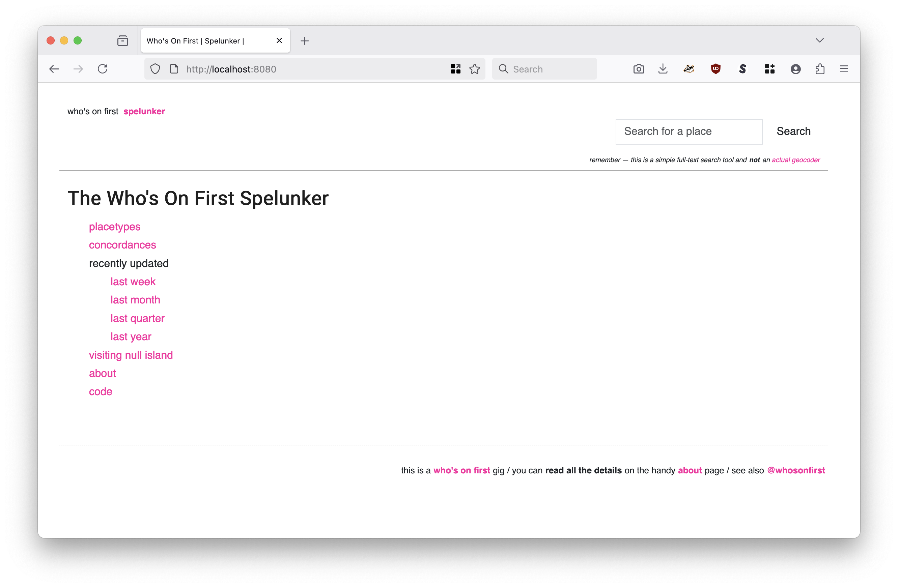
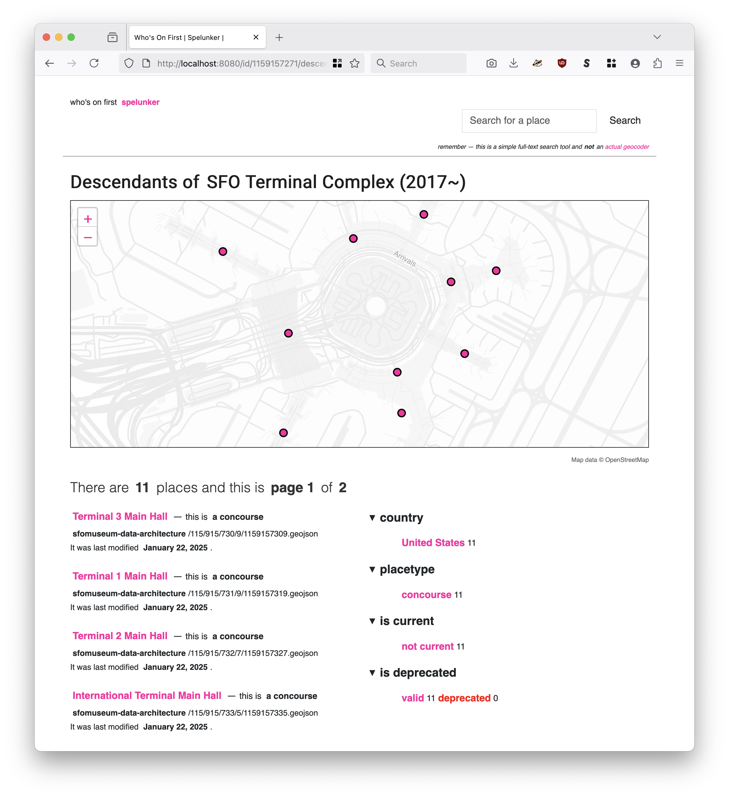
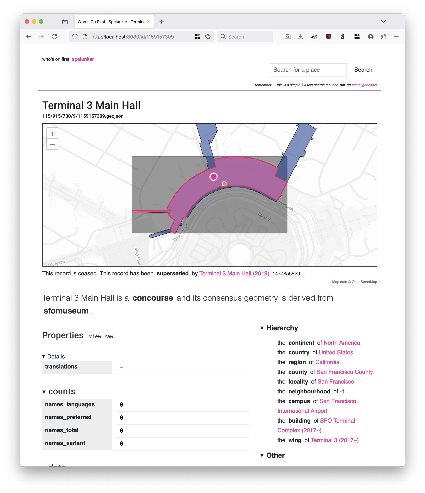

# wof

## spelunker

Launch a local [Who's On First Spelunker website](https://spelunker.whosonfirst.org) for browsing custom Who's On First style data.

```
$> ./bin/wof spelunker -h
  -authenticator-uri string
    	A valid aaronland/go-http/v3/auth.Authenticator URI. This is future-facing work and can be ignored for now. (default "null://")
  -protomaps-api-key string
    	A valid Protomaps API key for displaying maps.
  -root-url string
    	The root URL for all public-facing URLs and links. If empty then the value of the -server-uri flag will be used.
  -server-uri string
    	A valid `aaronland/go-http/v3/server.Server URI. (default "http://localhost:8080")
  -spelunker-uri string
    	A URI in the form of 'sql://{DATABASE_SQL_ENGINE}?dsn={DATABASE_SQL_DSN}' referencing the underlying Spelunker database. For example: sql://sqlite3?dsn=spelunker.db (default "null://")
```

### Database support

As of this writing the `index spelunker` tool has support for three databases: SQLite, MySQL and Postgres. Database support is NOT enabled by default and needs to be specified when you build the `wof` tool. These defaults may change in future releases but for the time being that's how it works.

| Database | Build tag | Notes |
| --- | --- | --- |
| SQLite | `sqlite3` | This flag enables SQLite support using the [mattn/go-sqlite3](https://github.com/mattn/go-sqlite3) package. If you are indexing a database with either the "search" or "spelunker" tables you will also need to enable support for the FTS5 extension with the `fts5` build tag. |
| MySQL | `mysql` | This flag enables MySQL support using the [go-sql-driver/mysql](https://github.com/go-sql-driver/mysql) package. |
| Postgres | `postgres` | The flag enables Postgres support using the [lib/pq](https://github.com/lib/pq) package. |

For example:

```
$> cd wof-cli
$> make cli TAGS=sqlite3,fts5
```

_Support for MySQL and Postgres database should still be considered experimental. Most of the development to date has centered around SQLite so there will almost certainly be "gotchas", maybe even bugs, with other database engines. For the time being it's best just to stick with SQLite databases when using the `wof spelunker` tool._

## Examples

First create a SQLite database to browse (or "spelunk") using the `wof index` tool:

```
$> ./bin/wof index sql \
	-database-uri 'sql://sqlite3?dsn=/usr/local/whosonfirst/work/test2.db' \
	-spelunker-tables \
	/usr/local/data/sfomuseum-data-publicart \
	/usr/local/data/sfomuseum-data-architecture \
	/usr/local/data/sfomuseum-data-whosonfirst
	
2025/11/05 15:17:45 INFO Iterator stats elapsed=29.556344625s seen=4501 allocated="23 MB" "total allocated"="18 GB" sys="572 MB" numgc=691
```

Now start the spelunker pointing to the newly-created SQLite database:

```
$> ./bin/wof spelunker \
	-spelunker-uri 'sql://sqlite3?dsn=file:/usr/local/whosonfirst/wof-cli/work/test2.db'
	-protomaps-api-key {PROTOMAPS_API_KEY}

2025/11/05 15:17:51 INFO Listening for requests address=http://localhost:8080
```

_Note that as of this writing a registered [Protomaps API key](https://protomaps.com/api) is required to render base maps with the Spelunker tool. There is an [open ticket](https://github.com/whosonfirst/go-whosonfirst-spelunker-httpd/issues/54) to add support for other base map sources._

Once you open your web browser to `http://localhost:8080` you should see stuff like this:





